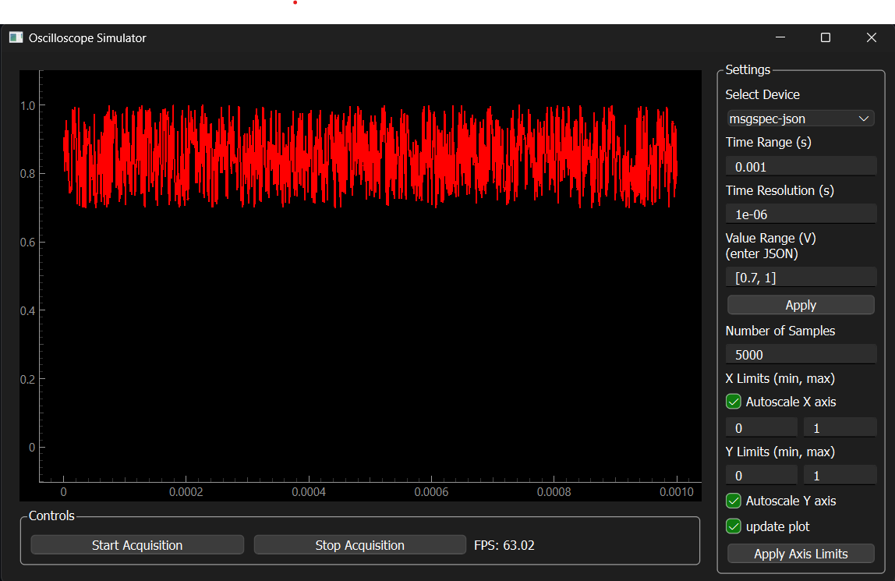

# Oscilloscope Simulator

An example for an oscilloscope simulator device along with a GUI in PyQt.

For a web GUI, visit [here](https://thing-control-panel.hololinked.dev/#https://examples.hololinked.dev/simulations/oscilloscope/resources/wot-td)
and for server only visit [here](https://examples.hololinked.dev/simulations/oscilloscope/resources/wot-td).
PyQt GUI is a standalone application that can be run on a local machine.

Currently used for speed-tests of JSON implementation (probably in future also other serialization protocols).

Docker image is available, just do:
`docker pull ghcr.io/vigneshvsv/oscilloscope-simulator:main`
for the latest image.
Make sure to set a hostname in the environment variable `hostname` to receive a TD with correctly filled forms. 

### Dependencies

PyQt6, pyqtgraph, matplotlib (optional), numpy, hololinked

`pip install PyQt6 pyqtgraph numpy hololinked`

### To run

- Go to server.py and run the script. 
- Go to graph.py and run the script to show the PyQt GUI.
- speed-test.py prints speed test for script-only access (i.e. without plotting which takes its own extra time)

#### Result

###### Access speed

just acccess all 4 channels + x axis (time axis)

|number of elements per array | msgspec | python's own json |
|------------|---------|---------|
|1e3| 5.1ms   | 8.7ms |
|1e4| 10.3ms  | 36ms  |
|1e5| 73.2ms  | 326ms |

1e3 means 1000 elements per array, which means that for 4 channels and time axis there are totally 5000 elements. 

###### Preview speed

Access all 4 channels and x axis (time axis), but plot only one channel

|number of elements per array | msgspec | python's own json |
|----------------------|---------|---------|
|1e3| 63FPS | 49FPS |
|1e4| 30FPS | 13FPS |
|1e5| 4.5FPS | 1.7FPS |

Processor speed - 3.8 to 4GHz approx

### Preview

 

Autoscale Y Axis dont work yet
